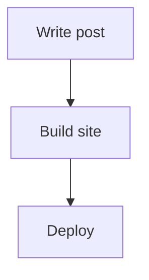

## Introduction

This is an example post for the hugo-omegion theme. It's intentionally a bit
longer than a typical "hello world" so there's enough content, and enough
headings, to try out the table of contents on the right — scroll down and
watch it track your position and tuck itself toward the top of the screen.

## Why this theme

hugo-omegion is built around a few opinions: a sidebar for navigation, a
readable measure for prose, and a table of contents that stays out of the
way until you need it.

### A minimal footprint

No JavaScript framework, no build step beyond Hugo Pipes. Just enough script
to handle the sidebar, search, and this table of contents.

### Dark and light mode

The theme ships with a color scheme that adapts to the reader's system
preference, with a manual toggle for overriding it.

## Typography

Prose styling covers the usual suspects: paragraphs, emphasis, and inline
`code`. Here's a bit of filler to give the page some scroll length —

Hugo builds static sites fast, and a theme's job is mostly to get out of the
way. That means sensible defaults for line length, spacing, and contrast, so
that whatever the writer puts in Markdown reads well without extra fuss. A
table of contents is a small feature, but it's one that shows up on every
long-form post, so it's worth getting the details right: it should appear
where the reader expects it, follow along as they read, and never cover up
the text it's supposed to help navigate.

### Lists

Ordered and unordered lists both get theme styling:

- Sidebar-first layout
- Client-side search
- Table of contents with scroll tracking
- Mermaid diagram support
- Syntax-highlighted code blocks

1. Write the post in Markdown
2. Run `make dev` to preview it
3. Ship it

### Blockquotes

> A table of contents that doesn't move when you need it to isn't much of a
> table of contents.

## A code block

```go
func main() {
	fmt.Println("hello, world")
}
```

## A diagram



## Tables

| Feature       | Supported |
| ------------- | --------- |
| Dark mode     | Yes       |
| Search        | Yes       |
| TOC           | Yes       |
| Mermaid       | Yes       |

## Scroll tracking

By the time you've reached this heading, the table of contents should have
settled near the top of the viewport instead of sitting where it first
appeared next to the introduction. Keep scrolling to see the active link
update as each section comes into view.

### Still going

This subsection exists mostly to add a bit more scroll distance and one more
nested entry in the table of contents.

## Linking to a project

Posts can reference a project page with the `project-card` shortcode, which
pulls in its title, launch date, summary, and logo:



## Conclusion

That's the whole post — enough headings to see the table of contents in
action, from the first heading down to this one.
