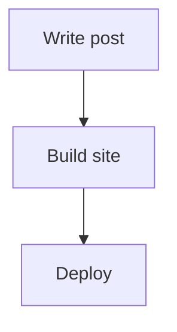

## Introduction

This is an example post for the hugo-omegion theme.

## A code block

```go
func main() {
	fmt.Println("hello, world")
}
```

## A diagram


```mermaid
graph TD
  A[Write post] --> B[Build site]
  B --> C[Deploy]
```

## Conclusion

That's the whole post.
